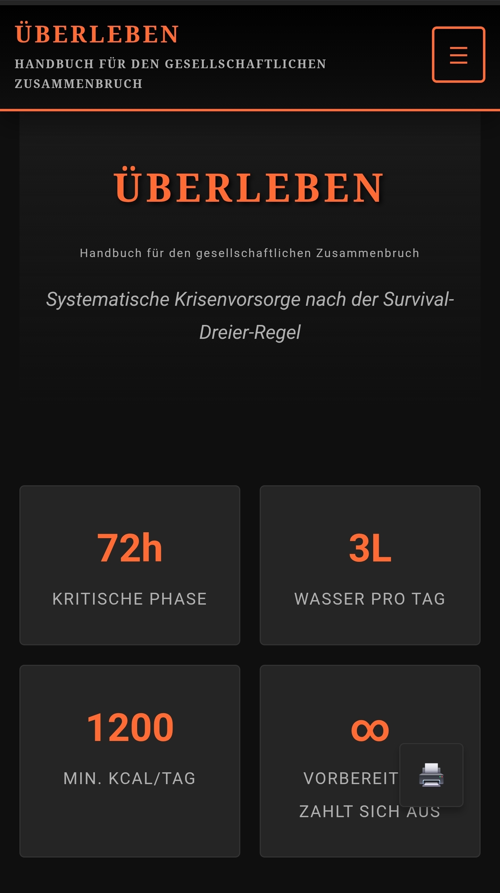

# ÜBERLEBEN - Handbuch für den gesellschaftlichen Zusammenbruch

[](https://yourusername.github.io/survival-guide/)
[](https://creativecommons.org/licenses/by-nc-sa/4.0/)
[](https://developer.mozilla.org/en-US/docs/Web)

## 📖 Überblick

Ein umfassendes, deutschsprachiges Handbuch für Krisenvorsorge und Notfallplanung. Von den ersten kritischen 72 Stunden bis zum langfristigen Überleben - strukturiert nach der bewährten **Survival-Dreier-Regel**.

**[🔗 Live Demo ansehen](https://yourusername.github.io/survival-guide/)**



## ✨ Features

- 📱 **Vollständig responsiv** - funktioniert auf Desktop, Tablet und Smartphone
- 🌙 **Dark Mode** - augenschonendes Design
- 📴 **Offline-fähig** - Service Worker für Offline-Nutzung
- ✅ **Interaktive Checklisten** - Fortschritt wird lokal gespeichert
- 🖨️ **Druckoptimiert** - spezielles Print-CSS für Ausdrucke
- ♿ **Barrierefrei** - ARIA-Labels, Skip-Links, Tastaturnavigation
- 🔍 **SEO-optimiert** - Meta-Tags, Open Graph, strukturierte Daten

## 📋 Inhaltsverzeichnis

### Teil I: Erste 72 Stunden (Akutphase)
- Wassersicherung
- Nahrungsmittel-Rationierung
- Unterkunftssicherung
- Kommunikationsnetz aufbauen
- Krisenpsychologie

### Teil II: Etablierung (Woche 1-4)
- Nachhaltige Wasserversorgung
- Nahrungsbeschaffung & Wildpflanzen
- Verteidigung und Sicherheit
- Medizinische Versorgung
- Krisenhygiene

### Teil III: Langfristiges Überleben
- Gemeinschaftsbildung
- Energiesysteme
- Subsistenzwirtschaft
- Lebensmittelkonservierung
- Handwerksbasics

### Teil IV: Kritische Skills
- Feuer machen ohne Streichhölzer
- Wasseraufbereitung
- Notfallmedizin
- Navigation ohne Technik
- Knotenkunde

### Anhang
- Ausdruckbare Checklisten
- Vorratslisten
- Notrufnummern

## 🚀 Schnellstart

### Option 1: GitHub Pages (empfohlen)

1. Repository forken
2. In den Repository-Einstellungen → Pages → Source: "Deploy from a branch" → Branch: `main` → Ordner: `/ (root)`
3. Warten bis die Seite bereitgestellt wird
4. URL anpassen: `https://DEIN_USERNAME.github.io/survival-guide/`

### Option 2: Lokale Nutzung

```bash
# Repository klonen
git clone https://github.com/yourusername/survival-guide.git

# In das Verzeichnis wechseln
cd survival-guide

# Mit beliebigem Webserver starten, z.B.:
python -m http.server 8000
# oder
npx serve
```

Dann öffnen: http://localhost:8000

### Option 3: Direkt herunterladen

1. Code → Download ZIP
2. Entpacken
3. `index.html` im Browser öffnen

## 📁 Projektstruktur

```
survival-guide/
├── index.html          # Hauptseite (alles in einer Datei)
├── README.md           # Diese Datei
├── LICENSE             # CC BY-NC-SA 4.0 Lizenz
├── sw.js               # Service Worker für Offline
├── manifest.json       # PWA Manifest
├── robots.txt          # Suchmaschinen-Anweisungen
├── sitemap.xml         # Sitemap für SEO
├── 404.html            # Fehlerseite
└── assets/
    ├── favicon.svg     # Favicon
    ├── og-image.png    # Social Media Vorschaubild
    └── screenshot.png  # README Screenshot
```

## ⚙️ Anpassungen

### URL ändern
Ersetze alle Vorkommen von `yourusername` in folgenden Dateien:
- `index.html` (canonical URL, Open Graph)
- `manifest.json` (start_url)
- `sitemap.xml` (URLs)
- `README.md` (Links)

### Inhalte bearbeiten
Die gesamte Seite ist in `index.html` enthalten. Keine Build-Tools erforderlich - einfach HTML bearbeiten.

### Checklisten zurücksetzen
Im Browser-Console eingeben:
```javascript
localStorage.clear();
location.reload();
```

## 🔧 Technische Details

- **Keine Frameworks** - Vanilla HTML/CSS/JS
- **Keine Build-Tools** - direkt deploybar
- **Keine externen Abhängigkeiten** - alles inline
- **~50KB** - schnelle Ladezeiten
- **PWA-fähig** - als App installierbar

### Browser-Unterstützung
- Chrome 60+
- Firefox 55+
- Safari 12+
- Edge 79+

## 📜 Lizenz

Dieses Werk ist lizenziert unter einer [Creative Commons Namensnennung - Nicht-kommerziell - Weitergabe unter gleichen Bedingungen 4.0 International Lizenz](https://creativecommons.org/licenses/by-nc-sa/4.0/).

**Sie dürfen:**
- Teilen — das Material in jedwedem Format oder Medium vervielfältigen und weiterverbreiten
- Bearbeiten — das Material remixen, verändern und darauf aufbauen

**Unter folgenden Bedingungen:**
- Namensnennung
- Nicht kommerziell
- Weitergabe unter gleichen Bedingungen

## 🤝 Beitragen

Beiträge sind willkommen! Bitte:

1. Fork erstellen
2. Feature-Branch erstellen (`git checkout -b feature/NeuesFeature`)
3. Änderungen committen (`git commit -m 'Neues Feature hinzugefügt'`)
4. Branch pushen (`git push origin feature/NeuesFeature`)
5. Pull Request erstellen

### Ideen für Beiträge
- [ ] Übersetzungen (EN, FR, ES)
- [ ] Regionale Wildpflanzen-Guides
- [ ] Interaktive Karte für Wasserquellen
- [ ] Audio-Version für Barrierefreiheit
- [ ] Quiz-Modus zum Lernen

## ⚠️ Haftungsausschluss

Diese Anleitung dient ausschließlich Informationszwecken und der Vorbereitung auf hypothetische Krisenszenarien. Die Informationen ersetzen keine professionelle medizinische, rechtliche oder sicherheitstechnische Beratung. Die Autoren übernehmen keine Haftung für Schäden, die durch die Anwendung der beschriebenen Techniken entstehen könnten.

## 📞 Kontakt

Bei Fragen oder Vorschlägen:
- Issues auf GitHub öffnen
- Pull Requests einreichen

---

**Vorbereitung ist keine Paranoia, sondern Verantwortung.**

*Erstellt mit 🧡 für alle, die Verantwortung übernehmen wollen.*
